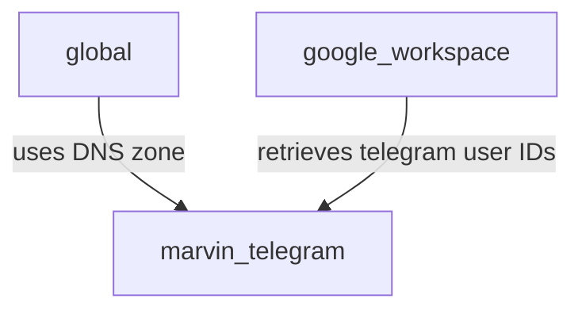

## Freier Family

## infrastructure

We are using Terraform to deploy all the family infrastructure.

Various modules exist, each one with a specific role.

Our main providers are:

 - [Azure](https://azure.microsoft.com/)
 - [Google Workspace](https://workspace.google.com/)

